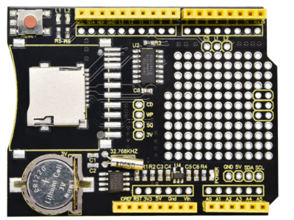
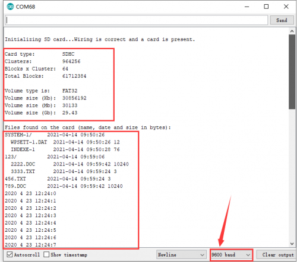

# KS0516 Keyestudio Expansion Board+TF Card for Data Recording



## 1. Description

When we conduct DIY experiments, we tend to connect some sensors with Arduino microcontroller to detect all kinds of data. And we will need to save these data and record the saving time for follow-up studies. Therefore, we have designed this expansion board to simplify this process.

First, this board boasts a DS1307z RTC (Real-Time Clock) chip to keep track of time. Second, the built-in TF card interface can connect with a TF card, which makes saving the information detected by the UNO board possible.Furthermore, to facilitate its expansion function, the board is equipped with circular welding holes with spacing of 2.54mm.

Please notice that this expansion board is only compatible with UNO control boards.

## 2. Specification

- Operating voltage: DC 5V
- Operating current: 60mA
- Maximum power: 0.3W
- Operating temperature: -10℃ to +50℃
- Dimensions: 68.54mm*53.38mm*23.26mm
- Battery: CR1220
- Environmental attributes: ROHS

## 3. Test Code

**Library files and code download：**[Resources](./Resources.7z)

```c
#include <Wire.h>
#include <RTClib.h>
#include <SPI.h>
#include <SD.h>
Sd2Card card;
SdVolume volume;
SdFile root;
const int chipSelect = 10;
void printDateTime(DateTime dateTime); 
RTC_DS1307 RTC;
File myFile;

void setup() {
    Serial.begin(9600);
    Serial.print("\nInitializing SD card...");
  if (!card.init(SPI_HALF_SPEED, chipSelect)) {
    Serial.println("initialization failed. Things to check:");
    Serial.println("* is a card inserted?");
    Serial.println("* is your wiring correct?");
    Serial.println("* did you change the chipSelect pin to match your shield or module?");
    while (1);
  } else {
    Serial.println("Wiring is correct and a card is present.");
  }
  
  // print the type of card
  Serial.println();
  Serial.print("Card type:         ");
  switch (card.type()) {
    case SD_CARD_TYPE_SD1:
      Serial.println("SD1");
      break;
    case SD_CARD_TYPE_SD2:
      Serial.println("SD2");
      break;
    case SD_CARD_TYPE_SDHC:
      Serial.println("SDHC");
      break;
    default:
      Serial.println("Unknown");
  }

  if (!volume.init(card)) {
    Serial.println("Could not find FAT16/FAT32 partition.\nMake sure you've formatted the card");
    while (1);
  }
  Serial.print("Clusters:          ");
  Serial.println(volume.clusterCount());
  Serial.print("Blocks x Cluster:  ");
  Serial.println(volume.blocksPerCluster());
  Serial.print("Total Blocks:      ");
  Serial.println(volume.blocksPerCluster() * volume.clusterCount());
  Serial.println();
uint32_t volumesize;
  Serial.print("Volume type is:    FAT");
  Serial.println(volume.fatType(), DEC);

  volumesize = volume.blocksPerCluster();    // clusters are collections of blocks
  volumesize *= volume.clusterCount();       // we'll have a lot of clusters
  volumesize /= 2;                           // SD card blocks are always 512 bytes (2 blocks are 1KB)
  Serial.print("Volume size (Kb):  ");
  Serial.println(volumesize);
  Serial.print("Volume size (Mb):  ");
  volumesize /= 1024;
  Serial.println(volumesize);
  Serial.print("Volume size (Gb):  ");
  Serial.println((float)volumesize / 1024.0);
  Serial.println("\nFiles found on the card (name, date and size in bytes): ");
  root.openRoot(volume);

  // list all files in the card with date and size
  root.ls(LS_R | LS_DATE | LS_SIZE);
  Wire.begin();
  RTC.begin();
  RTC.adjust(DateTime(2020,4,23,12,24,0));
   while (!Serial) {
    ; 
  }
}

void loop() 
{
  DateTime now = RTC.now();
  printDateTime(now);
  delay(1000);
}

void printDateTime(DateTime dateTime)
{
     Serial.print(dateTime.year(), DEC);
     Serial.print(' ');
     Serial.print(dateTime.month(), DEC);
     Serial.print(' ');
     Serial.print(dateTime.day(), DEC);
     Serial.print(' ');
     Serial.print(dateTime.hour(), DEC);
     Serial.print(':');
     Serial.print(dateTime.minute(), DEC);
     Serial.print(':');
     Serial.print(dateTime.second(), DEC);
     Serial.println(); 
}
```

## 4. Test Results

After uploading the test code, inserting a TF Card into the expansion board, and then stacking the expansion board with the UNO control board, we plug in the control board via the USB interface, and enter serial monitor page to set the baud rate to 9600. Then we can obtain all information about the TF Card and find that the ‘clock’ is ticking .
